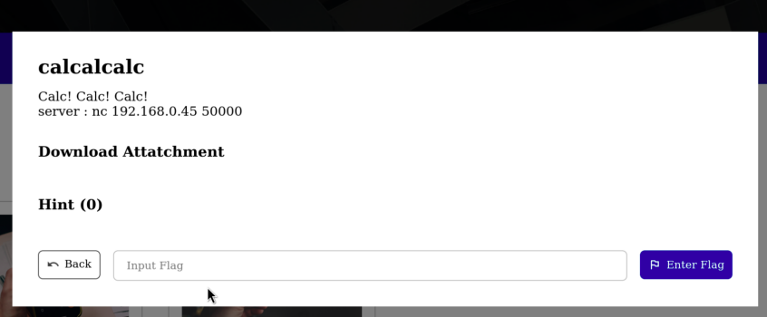
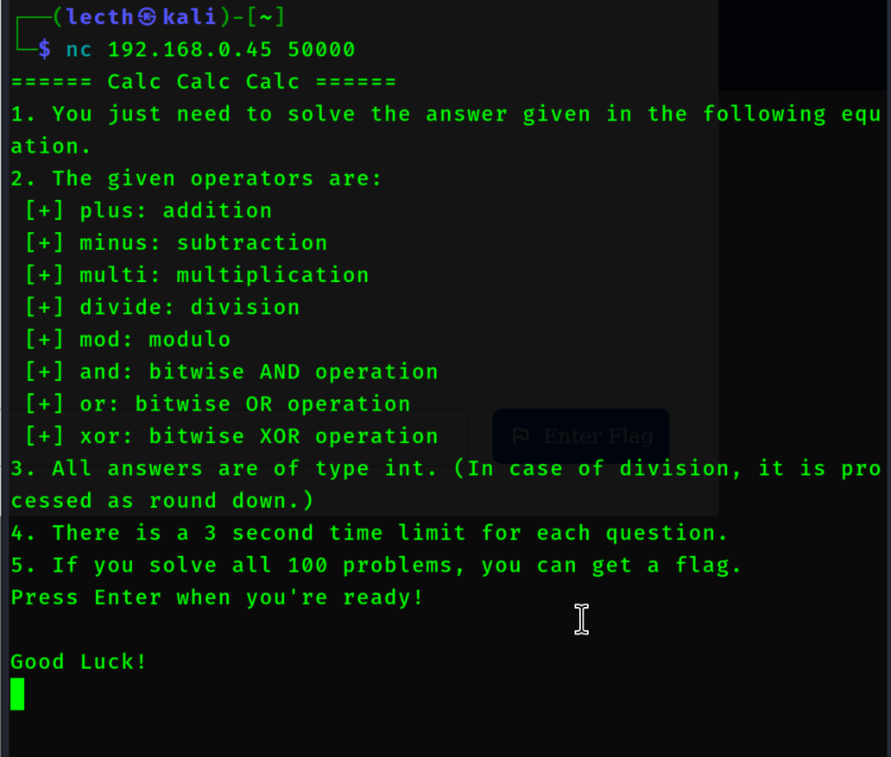
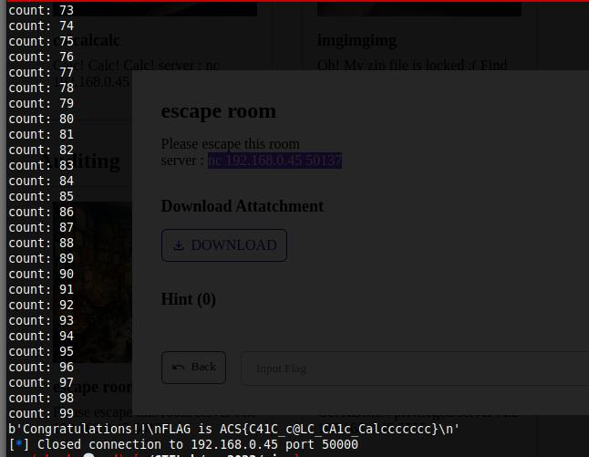

# calcalcalc (1000 pts)





We can see this needs scripting based from our experience for solver for each operation.

We can use pwntools from here that do the process what we need.

```python
from pwn import *
import math

r = remote('192.168.0.45', '50000')

output = r.recvuntilS('Good Luck')
r.sendline()
r.recvline()
i = 0
while i < 100:
    calc = r.recv().decode().split(" ") 
    res = 0
    x = int(calc[0])
    y = int(calc[2])

    if calc[1] == 'plus':
        res = x + y
    elif calc[1] == 'minus':
        res = x - y
    elif calc[1] == 'multi':
        res = x * y
    elif calc[1] == 'divide':
        res = math.floor(x / y)
    elif calc[1] == 'mod':
        res = x % y
    elif calc[1] == 'and':
        res = x & y
    elif calc[1] == 'or':
        res = x | y
    elif calc[1] == 'xor':
        res = x ^ y
    r.sendline(f"{res}")
    print(f"count: {i}")
    i += 1

print(r.recv())
```

and then running our code



**Flag:** ACS{C41C_c@LC_CA1c_Calccccccc}