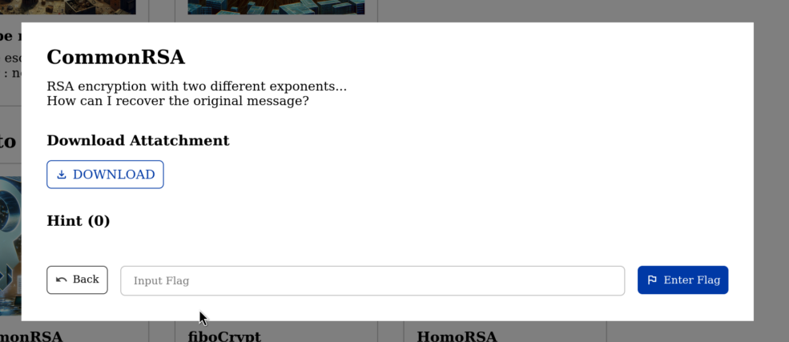

# Common RSA (1000 points)
#### by @lecth



Attachments:
- challenge.py
- ciphertexts
- pubkeys

Given two (2) cipher texts, encrypted with the same modulus and different exponents, we can recover the plain text of the message using the greatest common denominator of the exponents. (The title of the challenge is also giving us a hint).

Since e1 and e2 are co-prime, we can use the extended gcd algorithm to find the two integers.

```python
def extended_gcd(a, b):
    if a == 0:
        return (b, 0, 1)
    else:
        g, y, x = extended_gcd(b % a, a)
        return (g, x - (b // a) * y, y)
```

after that we do the common modulus attack:

```python
def common_modulus_attack(c1, c2, n, e1, e2):
    gcd, a, b = extended_gcd(e1, e2)

    if gcd != 1:
        raise ValueError("e1 and e2 are not coprime")

    if a < 0:
        c1 = inverse(c1, n)
        a = -a
    if b < 0:
        c2 = inverse(c2, n)
        b = -b

    m = (pow(c1, a, n) * pow(c2, b, n)) % n
    return m
```

with that, we can get the output:

```python
n = 151798642388037113811018958378137657993685455092850485442724380210449494948562438065241908373291003685092926779637963083491947591391619159652536147585036478723106569585124608391555798600577254245525732726133681780079153907891780299613770958387636919554574630254513742339024791779116952012938914178224296934261
e1 = 0x10001
e2 = 0x10003
c1 = 40484623901517443842786804306601874705216188257476641363163578348313167667314310386439419244904208320474107578625891334229529224715453792063593337575199350360650393467907278647049603351554639747016586375696746048862463118801429553166415564259339791238174259896483216977551264690637064291502469764455467816589
c2 = 26131442629994944883900141949959213729145024562514820488916932281022059266942054301226880998947378728223904070577555789927258181532633960472403688927536854859678562682055711090184399417354439263000793722252217506219821660195382053062963329694305123441806357529072885559760741511331691023685888498101475282910
m = common_modulus_attack(c1, c2, n, e1, e2)
flag = long_to_bytes(m)

print(flag)
```

**Flag:** ACS{RSA_C0mm0n_M0du1us_4774ck}