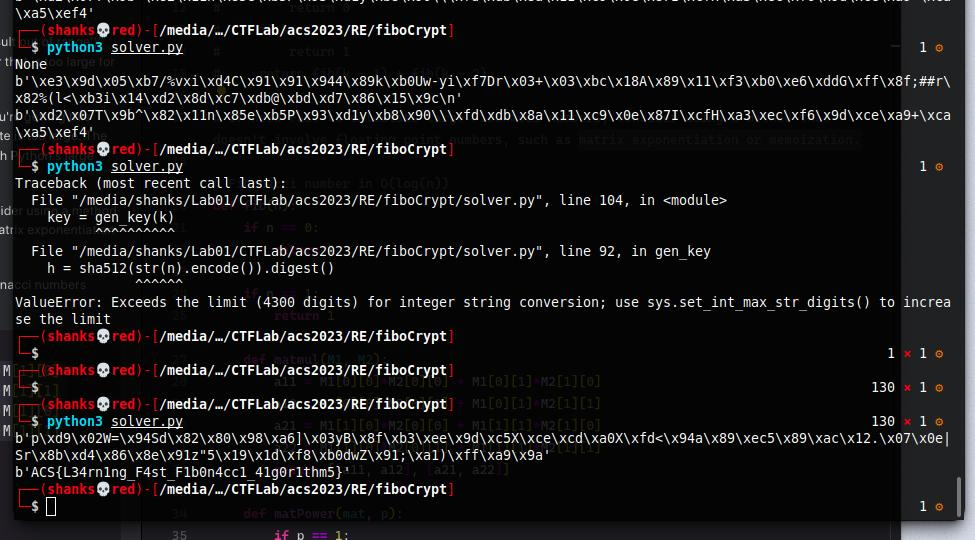

# fibocrypt (1000 pts)


```python
from hashlib import sha512
from os import urandom

FLAG = b"ACS{??????????????????????????????????}"

def fib(k):
    if k == 0:
        return 0
    if k == 1:
        return 1
    return fib(k - 1) + fib(k - 2)

def gen_key(k):
    n = fib(k)
    h = sha512(str(n).encode()).digest()
    return h

def pad(m):
    return m + b"".join([urandom(1) for _ in range(16 - (len(m) % 16))])

def unpad(m):
    return m[:len(FLAG)]

def encrypt(m, key):
    m = pad(m)
    c = bytes([a ^ b for a, b in zip(m, key)])
    return c

def decrypt(c, key):
    m = bytes([a ^ b for a, b in zip(c, key)])
    m = unpad(m)
    return m
    
k = 0xC0FFEE
key = gen_key(k)
ct = encrypt(FLAG, key)
with open("output.txt", "w") as f:
    f.write(ct.hex())
    
pt = decrypt(ct, key)
assert pt == FLAG
```

and we have also the output.txt file from the source

```
319a512c71a76716ecb1f6c102454d31fbeca8aca768a0f9c33bcc63a050eedc47b8d87a4332738bf3f9b888b8086ffe
```

What we need to do now is to decrypt this and using the hint from the challenge that it says we need to speed up the fibonacci algorithm since the n of fib(n) is very large.

```
0xC0FFEE = 12648430 in decimal
```

Recursive method will choke on this.

Since the current fib algo uses recursion but limits the maximum recursionlimit in python

If we need fast to calculate large Fibonacci numbers, consider using a method that doesn't involve floating point numbers, using matrix multiplication and exponentiation to calculate the nth Fibonacci number, which is a more efficient method than the traditional recursive approach. This method is based on the fact that Fibonacci numbers can be represented as a matrix that is raised to the nth power.

https://www.nayuki.io/page/fast-fibonacci-algorithms

We define a helper function matmul(M1, M2) that multiplies two 2x2 matrices M1 and M2 together. The multiplication is done manually for each element of the resulting matrix.

```python
def fib(n):
    if n == 0: 
        return 0

    if n == 1: 
        return 1

    def matmul(M1, M2):
        a11 = M1[0][0]*M2[0][0] + M1[0][1]*M2[1][0]
        a12 = M1[0][0]*M2[0][1] + M1[0][1]*M2[1][1]
        a21 = M1[1][0]*M2[0][0] + M1[1][1]*M2[1][0]
        a22 = M1[1][0]*M2[0][1] + M1[1][1]*M2[1][1]
        return [[a11, a12], [a21, a22]]
    ...
```

Another helper function matPower(mat, p) is defined to raise a matrix mat to the power p. This is done using the divide-and-conquer approach: the function recursively raises the matrix to the power p//2, and then multiplies the result by itself. If p is odd, the result is further multiplied by mat.

```python
    def matPower(mat, p):
        if p == 1: 
            return mat

        m2 = matPower(mat, p//2)
        if p % 2 == 0:
            return matmul(m2, m2)
        else: 
            return matmul(matmul(m2, m2),mat)
    ...
```

Then fib creates a 2x2 matrix Q that represents the Fibonacci sequence, raises it to the power n-1 using matPower(Q, n-1), and returns the top left element of the resulting matrix, which is the nth Fibonacci number.

```python
    Q = [[1,1],[1,0]]

    q_final = matPower(Q, n-1)
    return q_final[0][0]
```

So our final script:

```python
# Fibonacci number in O(log(n))
def fib(n):
    if n == 0: 
        return 0

    if n == 1: 
        return 1

    def matmul(M1, M2):
        a11 = M1[0][0]*M2[0][0] + M1[0][1]*M2[1][0]
        a12 = M1[0][0]*M2[0][1] + M1[0][1]*M2[1][1]
        a21 = M1[1][0]*M2[0][0] + M1[1][1]*M2[1][0]
        a22 = M1[1][0]*M2[0][1] + M1[1][1]*M2[1][1]
        return [[a11, a12], [a21, a22]]

    def matPower(mat, p):
        if p == 1: 
            return mat

        m2 = matPower(mat, p//2)
        if p % 2 == 0:
            return matmul(m2, m2)
        else: 
            return matmul(matmul(m2, m2),mat)

    Q = [[1,1],[1,0]]

    q_final = matPower(Q, n-1)
    return q_final[0][0]

def fib_worker(k, event):
    n = fib(k)
    event.set()
    return n

def gen_key(k):
    n = fib(k)
    h = sha512(str(n).encode()).digest()
    return h

def unpad(m):
    return m[:len(FLAG)]

def decrypt(c, key):
    m = bytes([a ^ b for a, b in zip(c, key)])
    m = unpad(m)
    return m

k = 0xC0FFEE
key = gen_key(k)

print(key)

with open("output.txt", "r") as f:
    data = f.readline()

data = bytes.fromhex(data)

pt = decrypt(data, key)
print(pt)
```


