# imgimgimg (1000 points)

#### by @dreb
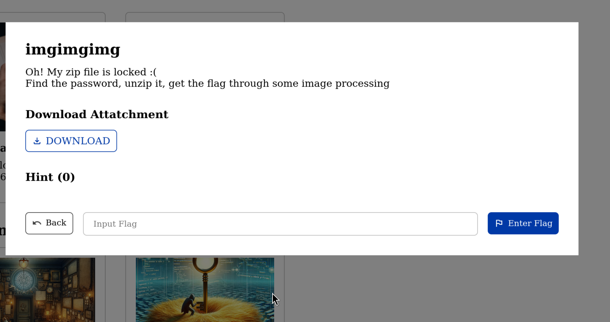

From the attachment given, we saw that inside the zip file is another zip file, an extra file, and a folder.

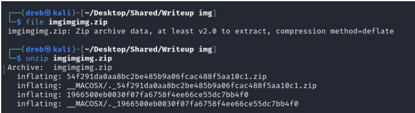

When we tried to unzip the zip file (inside), it asks for a password. Not knowing what the password is, we tried to check the other files. after doing the file command on the file, it results to saying it is a jpeg image.

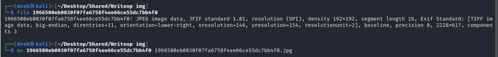

We changed the extension of the file to .jpeg. We then opened the image and it says:

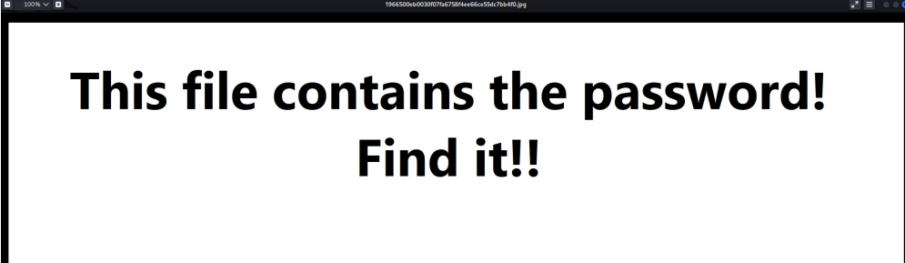

`strings` did not show anything meaningful text, so we tried `binwalk` and it shows that there is a PNG file hidden inside. However using `binwalk -e` does not work.

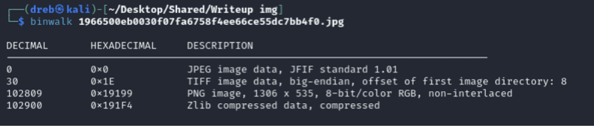

We used foremost to carve the file out, instead.

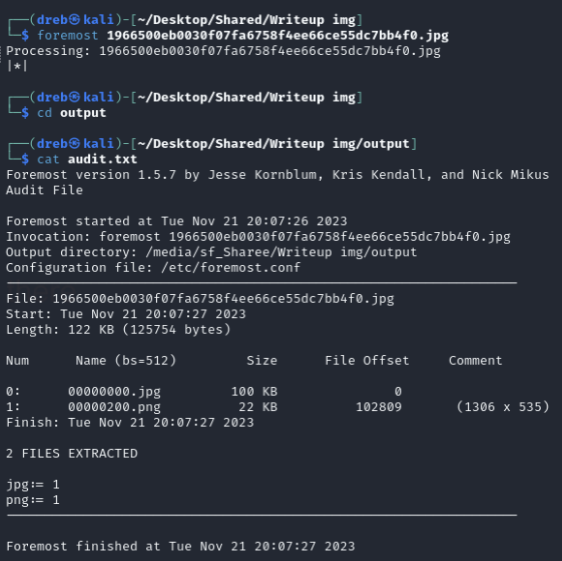

The png file then displays the password needed for the locked zip.

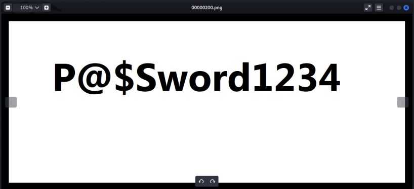

When we unzip the locked zip, we get 16 PNG files

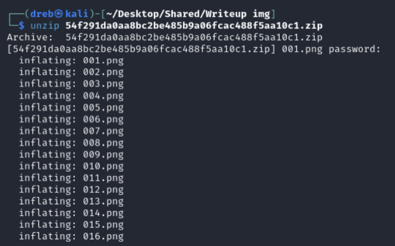

We see that the files are pieces of a qr code.

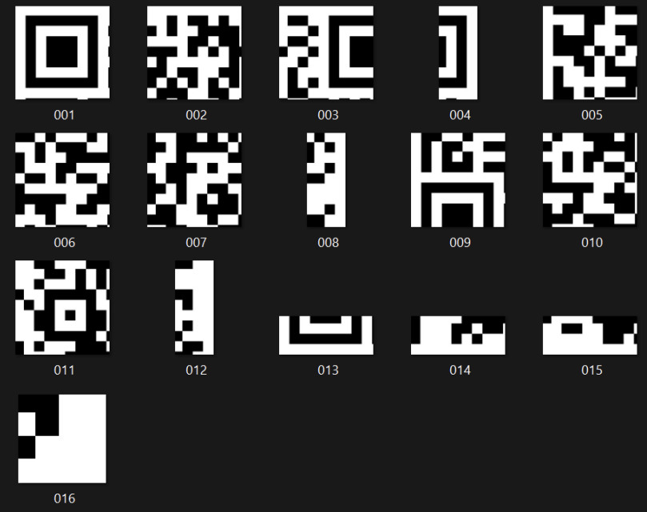

We can see that it has been split into 4x4. So we used `imagemagick` to connect the pictures together. We need to append all images horizontally using the +append command.

After appending, we get 4 images. Now all we need to do i just to connect them vertically using this command `./magick 1.png 2.png 3.png 4.png -append qr.png`

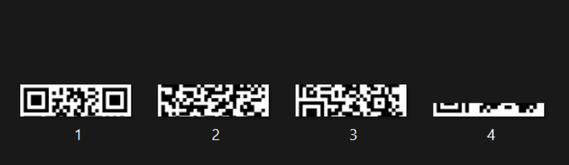

We now have the whole image ready to be scanned.

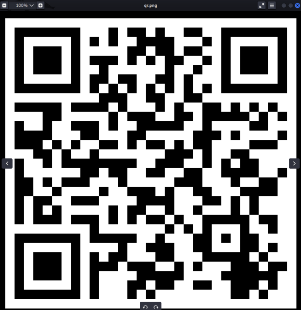

using `zbar image`, we are able to get the flag

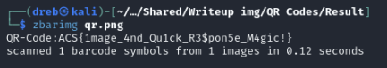

**Flag:** ACS{1mage_4nd_Qu1ck_R3$pon5e_M4gic!}