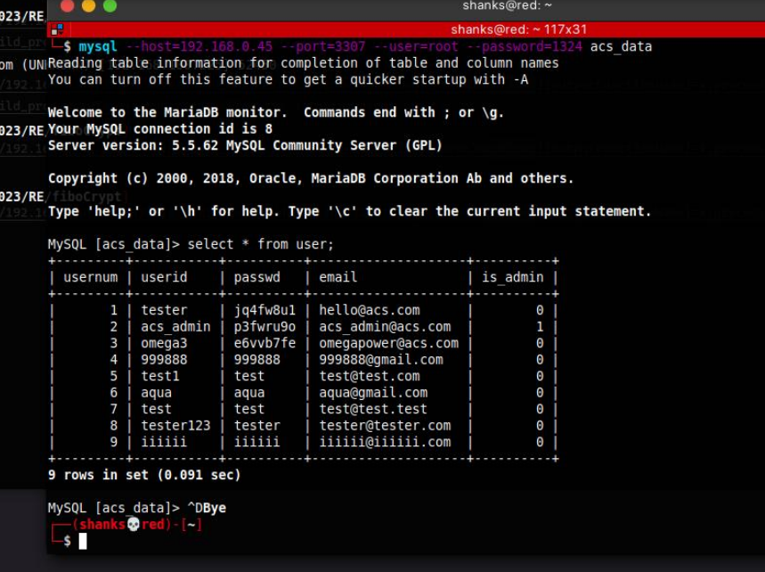

# Render Board (1000 pts)

Attachment: render_board_dist_update.zip

First step is we need to do some enumeration of the website.

Viewing the files given from the challenge, we notice a docker file configuration and an sql file.

Since the site needs an admin account, we need to gather accounts from the database and look through it using the command: 
`mysql --host=192.168.0.45 --port=3307 --user=root --password=1324 acs_data`

We then accessed the admin account

We got a hint from the hidden link. It directs us to `admin_notice` and from there, we are able to write a notice.

From here, we need more additional information. We started to look at the dependencies in the package.json file and saw that the ejs version used is vulnerable to Server Side Template Injection to RCE.

We found a POC from this link pertaining the version of EJS:
https://eslam.io/posts/ejs-server-side-template-injection-rce/

With that, we need to create a notice and get its `id`. After creating the notice, we craft a payload based from the POC:

`http://192.168.0.45:22223/main/admin_notice/detail?no=3&settings[view%20options][outputFunctionName]=x;process.mainModule.require('child_process').execSync('cat /flag.txt');s`

this payloads renders only the no=3 details, so we need to try with error outputs to get the flag.

Our payload works. 

With that, we realized that we can send the payload with curl. 

We found that the flag is stored from the `/` directory. With all that information, so @Aisle crafted the new payload and got the flag.

(We later found out, that this wasn't how you normally get the flag)

**Flag:** ACS{H3llo_3Js_m0dule_1n_NOdeJs55s}