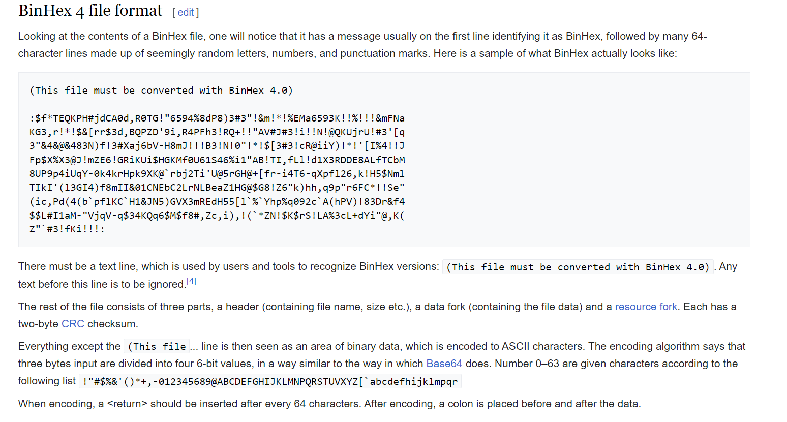

# HexBin (500 points)

Binary is older than you imagined, find the answer in 2.

go.ctf.site:10070

The `2` in this challenge is a file after browsing the link folder with `go.ctf.site:10070/EKO/` shows:

```
ENCRYPTED_1
ENCRYPTED_2
README.md
```

ENCRYPTED_2
```
:#hGPBR9dD@acAh"X!$mr2cmr2cmr!!!!!!#$!!!!!)r[5%NJ@N956b"*4L"C6e8
J4NP14#"85%P6)%P8)%e&38j6)%NJ9d&6)%0"8&498N9%)%*C)&4)45"'3NNX)%P
0)&"56eC*4%P14b"C6e8J9%K&)%&18eG&8L"86b"C6e95)%4&8e""59)+#N9,6hY
hG'KIDA0IG'KTFepPEQ0[C'PZChfRp`!!:
```

This crypto is [UUEncoding](https://en.wikipedia.org/wiki/Uuencoding), so we can use the UUdecoder to decode this file. But @dreb found out a missing header of this encoded text.



So adding the `(This file must be converted with BinHex 4.0)` as header will solve the problem on decoding.

```
(This file must be converted with BinHex 4.0)
:#hGPBR9dD@acAh"X!$mr2cmr2cmr!!!!!!#$!!!!!)r[5%NJ@N956b"*4L"C6e8
J4NP14#"85%P6)%P8)%e&38j6)%NJ9d&6)%0"8&498N9%)%*C)&4)45"'3NNX)%P
0)&"56eC*4%P14b"C6e8J9%K&)%&18eG&8L"86b"C6e95)%4&8e""59)+#N9,6hY
hG'KIDA0IG'KTFepPEQ0[C'PZChfRp`!!:
```

Tool used: [UUencode](https://www.webutils.pl/UUencode)

Result:

```
HI ZERO IF YOU FIND THIS IT MEANS I WAS CAPTURED BY THE FBI, IM PROVIDING YOU THE ANSWER TO YOUR DESPAIR

EKO{wth_is_this_encoding}
```

**FLAG:** EKO{wth_is_this_encoding}