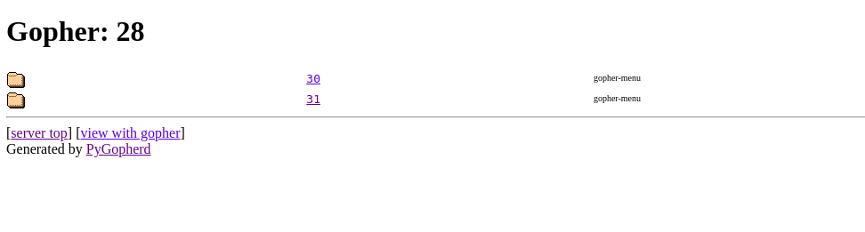

# Iter (500 points)

Look for 28 in EKONET

go.ctf.site:10070 

This challenge is a bit manual browsing the folders in the gopher protocol since there is no tool we can recursively browse the gopher protocol.

http://go.ctf.site:10070/EKO/28

So starting 28/ directory will shows another folder and iterate to the end.

In the iteration we will get 30 and 31 path, choosing 30/ will give a rick roll youtube link:
http://go.ctf.site:10070/EKO/28/30/2c/30/2c/4f/29/28/30/2c/30/2c/4d/29/28/30/2c/30/2c/47/29/28/31/2c/31/2c/47/29/28/33/2c/33/2c/20/29/28/30/2c/30/2c/59/29/28/31/30/2c/31/2c/55/29/28/34/2c/31/2c/41/29/28/30/2c/30/2c/52/29/28/30/2c/30/2c/45/29/28/34/2c/31/2c/43/29/28/30/2c/30/2c/4c/29/28/39/2c/31/2c/53/29/28/36/2c/32/2c/54/29/28/35/2c/31/2c/20/29/28/33/2c/31/2c/48/29/28/37/2c/32/2c/46/29/28/31/33/2c/31/2c/41/29/28/31/2c/31/2c/41/29/28/32/2c/32/2c/47/29/28/33/36/2c/37/2c/43/29/28/32/38/2c/35/2c/43/29/28/36/2c/35/2c/57/29/28/33/2c/31/2c/4c/29/28/31/2c/31/2c/20/29/28/30/2c/30/2c/4e/29/28/31/30/2c/31/2c/57/29/28/34/30/2c/33/2c/49/29/28/31/35/2c/31/2c/20/29/28/33/2c/33/2c/54/29/28/34/38/2c/36/2c/47/29/28/35/2c/31/2c/45/29/28/30/2c/30/2c/4b/29/28/32/32/2c/31/2c/7b/29/28/32/35/2c/31/2c/49/29/28/33/38/2c/31/2c/45/29/28/31/2c/31/2c/45/29/28/33/2c/33/2c/45/29/28/37/2c/37/2c/45/29/28/30/35/2c/31/35/2c/5f/29/28/33/38/2c/33/2c

So if we choose in the second path 31/
http://go.ctf.site:10070/EKO/28/30/2c/30/2c/4f/29/28/30/2c/30/2c/4d/29/28/30/2c/30/2c/47/29/28/31/2c/31/2c/47/29/28/33/2c/33/2c/20/29/28/30/2c/30/2c/59/29/28/31/30/2c/31/2c/55/29/28/34/2c/31/2c/41/29/28/30/2c/30/2c/52/29/28/30/2c/30/2c/45/29/28/34/2c/31/2c/43/29/28/30/2c/30/2c/4c/29/28/39/2c/31/2c/53/29/28/36/2c/32/2c/54/29/28/35/2c/31/2c/20/29/28/33/2c/31/2c/48/29/28/37/2c/32/2c/46/29/28/31/33/2c/31/2c/41/29/28/31/2c/31/2c/41/29/28/32/2c/32/2c/47/29/28/33/36/2c/37/2c/43/29/28/32/38/2c/35/2c/43/29/28/36/2c/35/2c/57/29/28/33/2c/31/2c/4c/29/28/31/2c/31/2c/20/29/28/30/2c/30/2c/4e/29/28/31/30/2c/31/2c/57/29/28/34/30/2c/33/2c/49/29/28/31/35/2c/31/2c/20/29/28/33/2c/33/2c/54/29/28/34/38/2c/36/2c/47/29/28/35/2c/31/2c/45/29/28/30/2c/30/2c/4b/29/28/32/32/2c/31/2c/7b/29/28/32/35/2c/31/2c/49/29/28/33/38/2c/31/2c/45/29/28/31/2c/31/2c/45/29/28/33/2c/33/2c/45/29/28/37/2c/37/2c/45/29/28/31/35/2c/31/35/2c/5f/29/28/33/38/2c/33/2c/4f/29/28/32/2c/32/2c/4f/29/28/35/2c/35/2c/4f/29/28/31/31/2c/31/31/2c/4f/29/28/33/2c/33/2c/5f/29/28/36/33/2c/32/33/2c/7d/29

will give a flag.txt file

**FLAG:** EKO{0mg_h0w_d3eep_1s_th1ssss}

