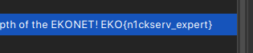

# Private (500 points)

go.ctf.site 16667

From our scanning results we can see that there is an IRC service running on port 16667. We can use the `irssi` command or `hexchat` to connect to the server.

```
16667/tcp open  irc
16697/tcp open  ssl/irc UnrealIRCd
| irc-info: 
|   users: 43
|   servers: 2
|   ops: 7
|   chans: 26
|   lusers: 36
|   lservers: 1
|_  server: go.ctf.site
| ssl-cert: Subject: commonName=go.ctf.site/organizationName=EKO{th3_f1rst_irc_fl4g}/stateOrProvinceName=Antioquia/countryName=CO
| Not valid before: 2023-10-22T03:44:22
|_Not valid after:  2033-10-19T03:44:22
```

After connecting to the server, we will run the command `/list` to list all the channels since the term `Private` looks like a channel for me.
After listing we got its topic description in the IRC server. 



**FLAG:** EKO{n1ckserv_expert}