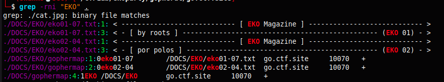
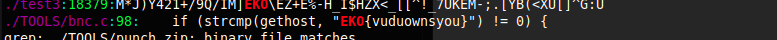

# Proxy (500 points)

Our dear friends from Ezkracho Team recommend us a nice utility to be used as a proxy, however, this one was protected with a singular password, may you find it?

go.ctf.site:10070 - gopherd

This problem is more like searching through the files of the gopherd. The only keypoint here is the term `utility` and `proxy`. With direct search of "EKO" string we found a flag in `/TOOLS/bnc.c` which is a proxy utility. 

In here I didn't know that the flag is for proxy. So I just ingored this because maybe this is just a fake flag but @lecth tried to submit it to proxy and got the score XD.

**FLAG:** EKO{vuduownsyou}