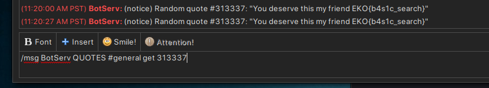

# Quotes (500 points)

No one will ever think about haxor quotes with flags inside.

go.ctf.site:16667

From our scanning results we can see that there is an IRC service running on port 16667. We can use the `irssi` command or `hexchat` to connect to the server.

```
16667/tcp open  irc
16697/tcp open  ssl/irc UnrealIRCd
| irc-info: 
|   users: 43
|   servers: 2
|   ops: 7
|   chans: 26
|   lusers: 36
|   lservers: 1
|_  server: go.ctf.site
| ssl-cert: Subject: commonName=go.ctf.site/organizationName=EKO{th3_f1rst_irc_fl4g}/stateOrProvinceName=Antioquia/countryName=CO
| Not valid before: 2023-10-22T03:44:22
|_Not valid after:  2033-10-19T03:44:22
```

After connecting to the server, we need to join all channels and look for quotes and I found that the BotServ will send a quote every users will execute the command `/msg BotServ quotes #channel` in chat. 

```
/msg BotServ help quotes
    QUOTES RANDOM
    QUOTES #channel GET <text>
    QUOTES SEARCH <text>
    QUOTES SECRET <text>
```

Running the command `/msg BotServ quotes search EKO` will give us a result
```
BotServ Random quotes matching your query: 313337
```

So we can get the flag with the id 313337 with the command 
`/msg BotServ quotes #general get 313337`



**FLAG:** EKO{b4s1c_search}