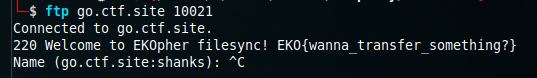

# Shared

Files are shared

go.ctf.site:10021 - ftp

From our scanning results we can see that there is an FTP service running on port 10021. We can use the `ftp` command to connect to the server.

```
10021/tcp open  ftp             vsftpd 2.0.8 or later
| ftp-syst: 
|   STAT: 
| FTP server status:
|      Connected to 49.145.184.88
|      Logged in as ftp
|      TYPE: ASCII
|      No session bandwidth limit
|      Session timeout in seconds is 60
|      Control connection is plain text
|      Data connections will be plain text
|      At session startup, client count was 2
|      vsFTPd 3.0.3 - secure, fast, stable
|_End of status
| ftp-anon: Anonymous FTP login allowed (FTP code 230)
|_Can't get directory listing: TIMEOUT
```



**FLAG:** EKO{wann_transfer_something?}