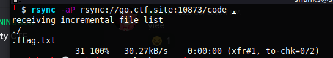

# Sync (500 points)

We use the latest technologies for backups.

go.ctf.site 10873

From our scanning results we can see that there is a `rsync` service running on port 10873. We can use the `rsync` command to copy some files there to our local machine.
```
10873/tcp open  rsync           (protocol version 31)
```




**FLAG:** EKO{rsync_&_critical_inf0_FTW}