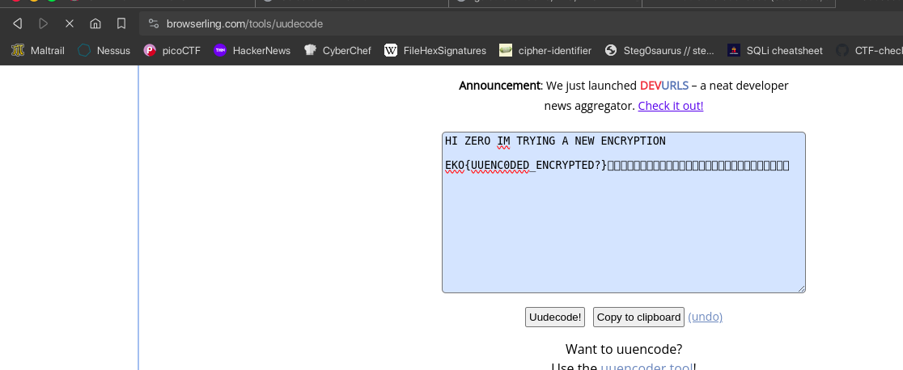

# UUEncrypted (500 points)

Look for 1 in EKONET.

go.ctf.site:10070

The `1` in this challenge is a file after browsing the link folder with `go.ctf.site:10070/EKO/` shows:

```
ENCRYPTED_1
ENCRYPTED_2
README.md
```

ENCRYPTED_1
```
begin 644 ENCRYPTED
M2$D@6D523R!)32!44EE)3D<@02!.15<@14Y#4EE05$E/3@H*14M/>U5514Y#
0,$1%1%]%3D-265!4140_?0`
```

This crypto is [UUEncoding](https://en.wikipedia.org/wiki/Uuencoding), so we can use the UUdecoder to decode this file.



**FLAG:** EKO{UUENC0DED_ENCRYPTED?}