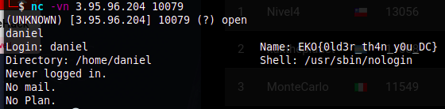

# Who (500 points)

My friend Daniel has a secret between his fingers!

go.ctf.site 10079

From our scanning results we can see that there is a finger service running on port 10079. We can use the `netcat` command to get information about a user `daniel` on a remote machine.

```
10079/tcp open  finger          Linux fingerd
|_finger: No one logged on.\x0D
```



**FLAG:** EKO{0ld3r_th4n_y0u_DC}