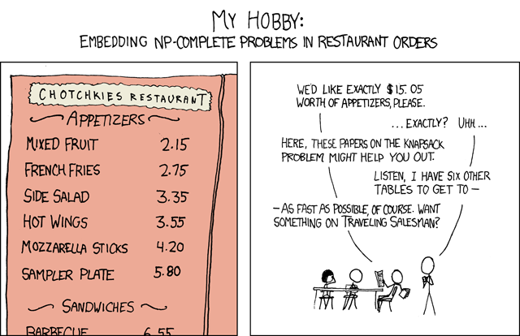

# Appetizers (500 points)


https://gist.github.com/AndyNovo/7527b97a69b7ee31c89ea6789f609abf

knapsack.py
```python
#Subset Sum Problem
#https://imgs.xkcd.com/comics/np_complete.png
import random
choices = list(set([random.randint(100000,1000000000) for _ in range(30)]))
random.shuffle(choices)
winners = choices[:15]
target = sum(winners)
winners.sort()
flag = "UDCTF{" + "_".join(map(str,winners)) + "}"
#print(flag)
choices.sort()
print(choices)
print(target)
```

output.txt
```
[19728964, 30673077, 137289540, 195938621, 207242611, 237735979, 298141799, 302597011, 387047012, 405520686, 424852916, 461998372, 463977415, 528505766, 557896298, 603269308, 613528675, 621228168, 654758801, 670668388, 741571487, 753993381, 763314787, 770263388, 806543382, 864409584, 875042623, 875651556, 918697500, 946831967]
7627676296
```

The code provided generates a list of 30 random integers, shuffles them, selects 15 of them as winners, calculates their sum, and then prints the sorted list of all integers and the target sum. The target sum in this case is 7627676296.

The comment at the top of the code mentions the Subset Sum Problem, which is a classic problem in computer science and mathematics. The problem can be stated as follows: given a set of positive integers and a target integer, is there a subset of the given set that adds up to the target integer?

In this case, the set of positive integers is the list of 30 randomly generated integers, and the target integer is 7627676296. The challenge is to find a subset of the 30 integers that adds up to the target integer.

There are various algorithms to solve the Subset Sum Problem, including dynamic programming and backtracking. One way to approach this specific problem is by using a backtracking algorithm, which tries out different combinations of integers to see if any of them sum up to the target.

In this problem, we are given a set of integers (the choices list) and a target sum (the target variable). The goal is to find a subset of the integers in the choices list that adds up to the target sum.

solver.py
```python
def subset_sum(numbers, target, partial=[]):
    s = sum(partial)

    # If the sum of the current subset equals the target, print the flag
    if s == target:
        flag = "UDCTF{" + "_".join(map(str, partial)) + "}"
        print("Flag:", flag)
    
    # If the sum of the current subset exceeds the target, stop exploring this path
    if s >= target:
        return
    
    # Recursively try including and excluding elements from the subset
    for i in range(len(numbers)):
        remaining = numbers[i+1:]
        subset_sum(remaining, target, partial + [numbers[i]])

# List of numbers and target sum
choices = [19728964, 30673077, 137289540, 195938621, 207242611, 237735979, 298141799, 302597011, 387047012, 405520686, 424852916, 461998372, 463977415, 528505766, 557896298, 603269308, 613528675, 621228168, 654758801, 670668388, 741571487, 753993381, 763314787, 770263388, 806543382, 864409584, 875042623, 875651556, 918697500, 946831967]
target = 7627676296

# Call the subset_sum function to find and print the flag
subset_sum(choices, target)
```

**FLAG:** UDCTF{19728964_30673077_137289540_195938621_237735979_302597011_463977415_603269308_654758801_670668388_763314787_806543382_875651556_918697500_946831967}