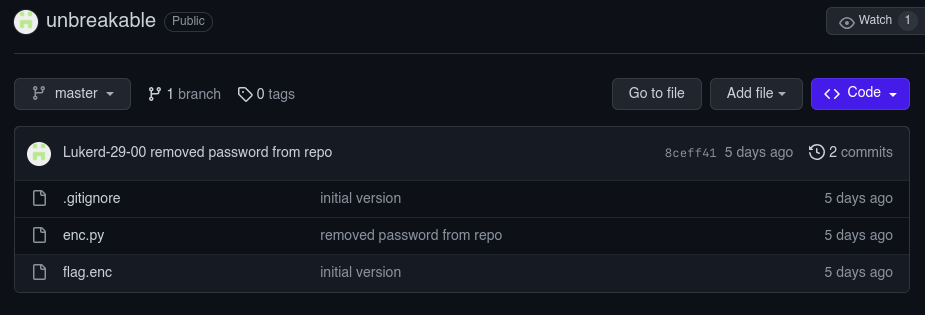
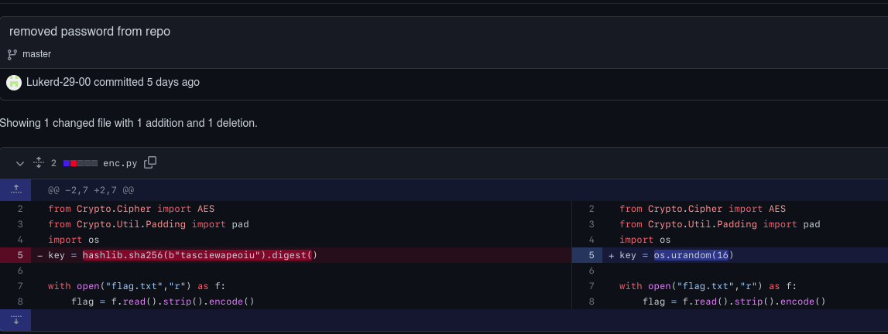

# Unbreakable (500 points)

https://github.com/Lukerd-29-00/unbreakable



This crypto problem uses AES in CBC mode to encrypt the flag. The key is generated using the following code:

```python
import hashlib
from Crypto.Cipher import AES
from Crypto.Util.Padding import pad
import os
key = os.urandom(16)

with open("flag.txt","r") as f:
    flag = f.read().strip().encode()

iv = os.urandom(AES.block_size)

ct = AES.new(key,AES.MODE_CBC,iv).encrypt(pad(flag,AES.block_size))

with open("flag.enc","wb") as f:
    f.write(iv + ct)
```

Enc flag content:
```
���y���p�W�#pb�1Ʌ�|�� s%2@'TW1@��F1��;O�^"L������Q����
```

The first 16 bytes are the IV, so we can use this to decrypt the flag. The problem is that the key is randomly generated, so we need to find a way to get it. The key is generated using the `os.urandom(16)` function, which uses the `/dev/urandom` file to generate random bytes. This file is a pseudo-random number generator, which means that it generates random bytes based on a seed. But this is not the case as we look back to the github repository it leaks the key in the commit logs XD.


So we can then easily decrypt the flag using the key `hashlib.sha256(b"tasciewapeoiu").digest()`.

solver.py
```python
from Crypto.Cipher import AES
from Crypto.Util.Padding import unpad
import hashlib

with open("flag.enc", "rb") as f:
    encrypted_data = f.read()

iv = encrypted_data[:AES.block_size]
ciphertext = encrypted_data[AES.block_size:]

# Key (must be the same key used for encryption)

# https://github.com/Lukerd-29-00/unbreakable/commit/8ceff412507d2122c28a09a5ad13b92e6dab96b5
key = hashlib.sha256(b"tasciewapeoiu").digest() # leaked key from commit log XD

cipher = AES.new(key, AES.MODE_CBC, iv)
decrypted_data = unpad(cipher.decrypt(ciphertext), AES.block_size)
decrypted_text = decrypted_data.decode('utf-8')

print("Decrypted Flag:", decrypted_text)
```

**FLAG:** UDCTF{N0th1ng_pr0t3cts_4gainst_5l0ppiness}