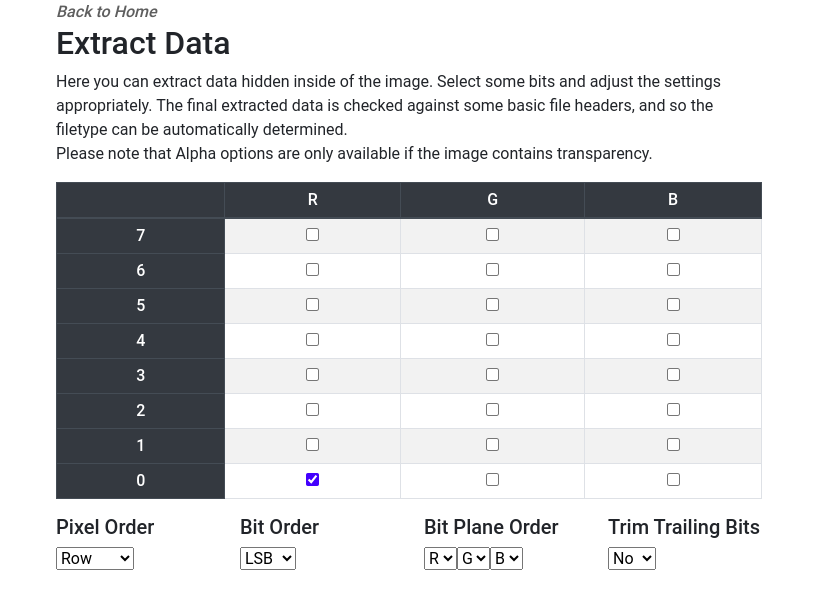

# Least Significant Color (500 points)

I can't decide which color is the least significant... red xor green?

This problem is a steganography problem. The image has encoded data given below:


After analyzing the problem @dreb said we need to extract data each color RED and GREEN then XOR them afterwards. So using https://stegonline.georgeom.net/extract for extracting LSB data.

Get the hex dump of RED


RED Hex dump:
```
490418a49cdc6273142a691d378870c2955d0fdfb20efe41fbd06e3c6f716aefbb72af3675797888f5bae912a4a555c98244bc6fd7fb606ca0ea277f302131f9678b8da77284dfde6a5df5df9a92745b97609409303eb9f5d04f69c76ccc53d972677f50124ebef6c04fd37cf7d8573248eeae403ab110eb6548965bc12f6f72e6e75212613d08b048a128939d4657eff4c6f324be8c80b057eee0e14f83273f99abf99a6812c84624868fd4bfab2dc754610af43995f91a5630c01a4d3df8455197eda4009dd1c71f6f59f3a67c5738d45b206a57b3f0f90d77d354fbe227ae892c55697ca801ced7a399e51cb98ef8b7b4bca12e1fcb415be50b7ca46e5813b592dd347dedbe5e35db050b53dcc4c9829db944b0fdd7266382326bb269e05c1a056ce643f6001e43bfde6cc157e78f3a4884e2c4dbd76da9878052aee6d7edf964ed7542686101ca8bf99e5f7ae1881c9a9fe6170abb90305a5f610cbf560a1b79e15df6cdf788ff9ea4404fcdbb075faa51e41e1aa456c76045aee12b6a6fbacf83e29e3c3a078960bfa1a8034552869eeb761f2edfa2549d34924a39fa6d3e840b306a09a69c7eb3e8fd18a4cffd57467bc970e0ba1892602bb254ddcee4a4201513e9b18458f4fb9c274ebabd88c4b2806eab35ea14fd5b2b2357eb4f73746bb40cf892464edd8a9615683b044224bbe2d051c3210b83b0d9fe13dc0985c6ab3bfe5e3699c1f66eeac9741121221c05877f73031bd3a2003236e9cd86114c7c6568b54b8b8b3901837393e80699f3e798a4f86b1dd90b69962810251bb8ae09cb810b5318087afdf06cd1503308ce9a8a9a536618e0e754e18bb31afe90d3db99d833ff0b56b5df01025a3e782cf27d66737de2547fc819cd512adfd4670e1805445b8d085209b0459ec54de8a1f35e576d4767a7cbe4f5d0e39d5978762d90ae9423a41a06e74003396f89ef6d75df1a10f73197e4ef2b269fe3222f9febb62c0efd09b2d12fbe7b799f87ddcdf558cacabeeadf5d077e0a97ed75b9e0c84383ec2dca83b6a619dd027c1db6d2d06019ca834f3ad58c115bd1384514a158412f23d119fa7429b33598a83ae7692a719f9b236b5c14c94c29eab468d2f82347a37d4e084f63c4f4fc598b7e38c5f9201cb39bda072d1bd173b58c35984db6b55a220a4265459fef6d7746aade985b079f915b36204536a2b0696085d64fa84662978d46d79a3e402d4c53271eb578482eaa1dc7a528f17c1cd079797b94cb1a68aed5517fc9d31027dce6f2c5e4d39fcf0c37b4a73936540a14b309b3302bb17832ed35e20d1deff44bb585c5b5e4e485c3d4bc9f42b9d54712a7e4f28d5ba71f7e6921a01975072f9edb2e6ac5297edc35801f59566effe150795587610dc69e56f56fa5fdbfe6afc514a45f82c75458360ceec49e373bcf112c15fa886f911cf57e552fa533b063a217e59d661cfdd2611aceca0ccbcee16baed693194858fba9bfe25c26f0cc2b66f80b867f3cf9afd94f85a663532643fe51be84f9a38c9f59f3256e466f5ce1bfa8138ccf2e610f84c341f0c2b35cef7412d83c3d53be80fdb0fa8a58426a01f1be1ff01f50e239a018e0671cc5b778bc23fef5b3cbec02b0a55c98c1a2cf2432638bc089b94b5dac154064d16383f74db9ba16dce01a95ee8b11eb3bb8d5b4855d0ecb28832900632e072c2ab5d8ac0715320d68a87164bf21519f58eedcac1edf5cffa59b15776845275d57feea8d13d05b57122b18
```

Get the hex dump of GREEN:

GREEN Hex dump:
```
1c405bf0daa71b4361753b4206e511a5a60278b6c8549f33bfad99418f8d91ff5c3c8ac586e0c2d2ad655dca4b43ef155430221869351e4a245311aca674fe1b2994d8499d35f0198bc2cddf9fb09bc479a01796d352dff202308239be61892cedc98897e591d9193fb03ca3452fc9f8171151720270a59b5df1945a8e574b52e4e75206293d00f26ba105d91d4646257d28a0221ecc80b33733e0960d23a636b9000065b7ed02a1617b702b4353d2182ff18eda3d9026e5a9cfbfa5b6c207be71a600442bedc24d1f9f55d5d42516f45aab7b5b3d2a48195275b157b6452c5dd897f7f470766aec72a3e912f000dbadc06ef3e2afe0fa780457d22a67ba6a87ebe75d66388467ef7198caf3a4fbbb2fcc7816ffdd2819b79265d41bdc0bc9335eac1082e058e0b8db8de4113ea7278f7db69e98e458dfed2b0780e4421b2f071fa506c9b6abbcfe157056f1340aabcdd745e839e8451354785110911e4fcc47077ac95df1c9f78ef798a5400fc3bb0f5cb904e0d0478a5ec764865ade7a33483aa98307fb43e55a769134c1f7bca2ad7961178c96783f8a59c2c9eda5c6059acd7f74b679910e3ab67cd8a22969cd8ebece8fb62fe70bce59fcb6d7cf4df367d265ff14da55a858ba6561d7fa3c2044f066845dcde896d8fde704fb8b2b8392f6615ce1edc4604c367e6770a2d6de8ffa1441173f642af4fa6222c1d7bd46c9d98ed1c911a1ca9f9624e8af9e83d40dc28c47010dfea3f3238c4320ebce5bae3247fe860af48274e76e7c846e5f99e7b853a7e92794f225dcb6dc48955ab879ade1dd430a0059287bfcf049d310352cc41c0cdaf3dee3c3ab44e19ce336408a2a27de2073ff43fbba20fefd8bb1b9530d8a98849218fb8f6a9fcdd0f9aa0fd8f9e7fa87a662a84ee1c95a4a6adc6f4c4dfd1c76cebcda378308160476d6b8f72fd18eac632d6ae0084bef6935bbf2d978aa6acea5001379c114e5f734d9fdfe1f13f9dcdf3a1b5f0cab8d1269792f634a29ff6f413a3aceaf0e266b236d3437b5982ae5f6e2a9768ba3e82b6f7ca8eddfbc2e3f09406d3975ef1bd7350331a51486d0d694a5e593b09f8bf67ed959b7579e693e7594a3a134b3d5154a6df8b05c656373642baf7325e6fcd8cb7e3ac9f9201c879bfb278d6c51a70dac3d9255b6eb595ddaf925651fe17dfca85f25cdde47606eb1c9dfbac17d4e595506fe571209bd485229ba61c4c22b48eabd364d08cd61a402d0b939e113b12a0d2d62d550ece1aed56163cb684a1c29573d187cbe56c435c6d9db5da811b4a84a640f571d453fb485dacaf6de6ad84b49cd96344a63eea58fe3784f1d623a66a0c76a27603fb102d056d0208eff1cdc6d029b52f95313e00202e243cd282e0d847d3651f78dde5e4e54db0e8d73c162c65fa05da8abc749f9110e01c8d430acd0f815e8be94b93c72bead872690026e1fe59d421efdd0611aceec8ccbce3903c6b782234800fbb945ea6c1e6f1429e7caf9f98083468d3feafa599cfccdb8018d45bee76e8c9b2cb8cad98390651e6058535653d54f8b41c970ad0c57584d27af230009cc425f05473c5f8f5b960e37d1b13688b30db32c44622b993bb397555c3d0f8d43e5bf461be96aacd43d06b69d87e27a72b33bf026bfd5368e48b0e2d47881d7fe07a023250d27b2f664794601bebef040684890569dbab149ea36f0638df2c1b87af87cc1519437112350f1003a0a39406818bfa858a6aa07d065ee6fa4a8edf46f
```

Reading again the problem description it says RED xor GREEN. So we need to XOR the RED and GREEN hex dump using [XOR Calculator Online](https://xor.pw/)

Output
```
55444354467b7930755f525f316d6167335f77697a5a6172447df77de0fcfb10e74e25f3f399ba5a58dfb4d8efe6badcd6749e77bece7e2684b936d39655cfe24e1f55eeefb12fc7e19f38000522ef9feec0839fe36c6607d27febfed2addaf59faef7c7f7df67efffffefdfb2f79eca5fffff3238c1b57038b902014f782420020000144800084223002d4a800011ca89ee5306a040000360dd007742a0810920abf9ffdfffcae745fdfffffcf8ffdf7b90842e0405dfffffff7fbffbfffffb2031ede02b70138a00f00c26725941cc8ef05b316a99b8e05f0262034da70bf351bba29d0cde6b22a50070f7ecb9555577da4f4381ff31395fb2d956c3d432945e7580524569d9b14443cff8f7277fe64ee5afbb6dd5ce91f1e7e6706e62296f44a97c64a3aee0a698323a7dfff0c00047fe1a7a20830880828000b6ecfdf8eae6c1ebbcf4c3ddffdffbaf6f6b704a45cbdf77dfff4fa8c4480b4ff012f09a4d1c0328000704000608060100400e000803135504ce5d2e080004c3f43f515927806600e5657fdf5dfff18b605fbfe7fffffffcfa8956e0280d5ffd7feffffff7f3fb7f861398a8a6c8cf305f31cd0273e988f47f5f07b1d6cb9c9d659b903d837645ea0733e42c004e9efdf0b4869dcc34d4043366dd7ccc00bc2fd8dcc0cce1820ae8ed15562602ebf4f165caeddacddeafa3c76ea70bff79d2fb3fc4614f4c1f25ea374f97535e604a0266ea92f52fde89c07e7efdb820818c71160203ddbf7e3b9beebfbf09ffde6ffff7fdb79f7e4bb43f4ddfffeffcd7df4a60857fa3c103e816c20153412001010025024006240a868640a0b8fb234c100017502cbe1af9fc47f8400048ad0fffffffd18fc17ffff7fef7effaaff0a2860081d375dbbff7ffffc3fdefa01ce8791fd4af9187edbea34b1b89db7dfc67fdc6e7eb8fc08102412038408970e6ef0bec505a321db40d7570de5231849d2e3fc368d7fbd261f4a5d5d22233a98e2315f66bf6fef2aebf7135a5ffd0e593a8702cfcce188dd77ddba909db282ac02dba352913611e3f0fdc37f58a0f57ecf9fe40060d4625044cc7fff545bc1fe7992cbe6ed6e3bede7deff6a556ffffb5fdfffcfffe052a487f22c00e2a23e010e11200814000020c00000034002120a07780d4b820080a18005e037fd0bb4020800e108beef5fb558540ffffeafffffff7dffe3035832818ba4fdfdfdf6f6dfbfa820604b99a28f870854f0e1f171c11106fadfa745419419bf6890000301c02bb5a3bf5b1cfdd986dc90b39f16d7c649e45bebcf96dbc6736f4478668ef28fbc3852c00fc485381ae876b665b5fe70da4b77d74072398aa3b98ae7cb9777039fbf83342b62cf197d02dcfd5821dbb15a3d7cf5dfd28b130fa4b4008bb3b7ef332956ea7d2fbffdf6fff9f7ff5ffca9fffefffbdfcedef60d105a5c90ceb8222152061cc0800002402000200000026800000d8686861113a00580010fa0830389fd8028132f27fffbfbf22e6a57fffffafebfbffdcfb3a1ecd0004754befb7c5ff39ffdff040da9cfb2e84c50a315dcee404a253bdfb3c349ffcdff8f7c6d5d719fc0fc66faec697e3ef8a8c5c824c85fe04efe97fc3fa3e8809bdf6beb5f26d76f22284fe0c22f3cbf8665c33ffb1e7edcb47af6dc2970b1e1d35cdae1ccc894eb1cdc35cb075d8c34148f3789a969bfc329af776bfffa9100b9cc3e0000b6ffffffcefdf66f59cdb7d6fd7ed7ffbfdf93ae8fdbfffffffdf77
```

Unhexing this will give the flag
```
UDCTF{y0u_R_1mag3_wizZarD}÷}àüûçN%óó™ºZXß´ØïæºÜÖtžw¾Î~&„¹6ӖUÏâNUîï±/ÇáŸ8"ïŸîÀƒŸãlfÒëþÒ­ÚõŸ®÷Ç÷ßgïÿÿïß²÷žÊ_ÿÿ28Áµp8¹Ox$ HB#-J€ʉîS @`ÝwB 	 
```

**FLAG:** UDCTF{y0u_R_1mag3_wizZarD}
